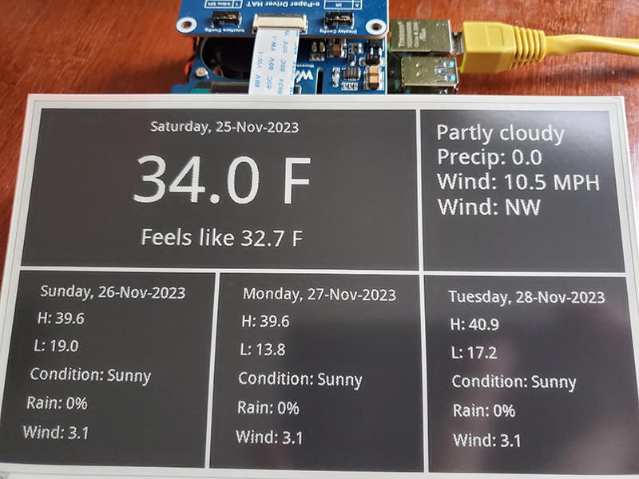

# e-Paper Forecaster

This project is intended to display the current weather and 3 day forecast.

## Items used in this project:

- Raspberry Pi 4b 8GB
- Waveshare PoE HAT
- Waveshare 7.5 inch E-Ink Display HAT, 800x480 Pixel Black, White Two-Color E-Paper Screen
- Waveshare EPD

For this project I choose to use <https://www.weatherapi.com>

## Instructions

1. Create an account at <https://www.weatherapi.com>
2. Copy your API Key and insert it into `forecast.py`.
3. Set your Location.
4. Set your interval for refresh, currently set to every 4 hours, change it as you see fit.
     this setting is the `time.sleep(14400)`
5. The days are set to 4, this gives the current day + 3 days of forecast.
6. Run `python forecast.py` or to put in the background `nohup python forecast.py &`.

